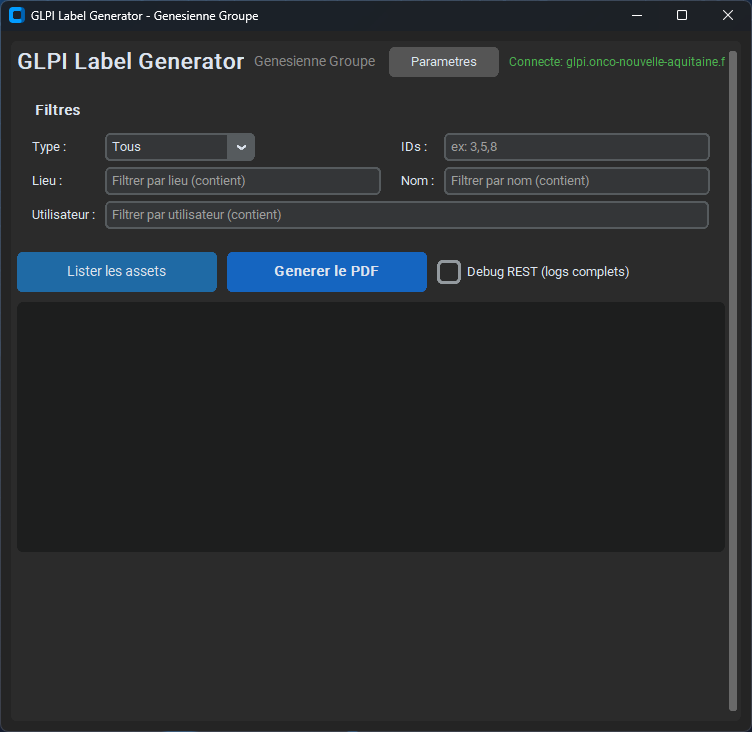

# GLPI Label Generator

Inventory label generator for GLPI with QR codes. Portable desktop application with modern GUI, compatible with Brother label printers (PT-P950NW, PT-P910BT, etc.).

> Generateur d'etiquettes d'inventaire GLPI avec QR codes. Application desktop portable avec interface graphique moderne.

## Features

- Connects to GLPI API to fetch assets (computers & monitors)
- Generates QR codes linking directly to GLPI asset pages
- Produces PDF labels with: QR code, name, type, serial number, location, inventory number, company logo
- **Custom ownership text** — display "Property of: Your Company" on each label
- **3 tape sizes**: 25mm, 36mm, 50mm — layout adapts automatically
- **5 color modes**: Color, Black & White, Monochrome, Inverse, Inverse Mono
- **First inventory date** — shows asset age at a glance
- Filters by type, location, name, user or specific IDs
- Built-in demo mode with sample data (no GLPI instance required)
- Multi-language support: Francais, English, Espanol, Deutsch
- Persistent configuration saved in %APPDATA% (survives exe updates)
- Dark mode interface
- PDF opens directly after generation (no save dialog)

## Download

**[Download GLPI_Labels.exe](https://github.com/tienou/glpi-label-generator/releases/latest)** - Portable, no installation required.

## Screenshot



## Quick Start

1. Download `GLPI_Labels.exe` from [Releases](https://github.com/tienou/glpi-label-generator/releases/latest)
2. Run the exe (no installation needed)
3. Click **Settings** to configure your GLPI instance:
   - **GLPI URL**: Your instance URL (e.g. `https://your-instance.glpi-network.cloud`)
   - **App Token**: From GLPI > Setup > General > API > Add API client
   - **User Token**: From GLPI > Your name > Settings > Remote API token
   - **Logo**: Optional company logo for labels
   - **Tape size**: 25mm, 36mm or 50mm
   - **Color mode**: Color, B&W, Monochrome (pure B&W), Inverse, Inverse Mono
   - **Owner**: Custom text displayed on labels (e.g. "My Company")
   - **Language**: Choose your preferred language
4. Use filters to select assets, then click **Generate PDF** — the PDF opens automatically

## GLPI API Setup

### 1. Enable the API
- Go to **Configuration** > **General** > **API** tab
- Set **Enable REST API** to **Yes**
- Save

### 2. Get the App Token
The App Token identifies your application to GLPI.
- Go to **Configuration** > **General** > **API** tab
- Scroll down to **API clients** section
- Click **+ Add API client**
- Fill in a name (e.g. "Label Generator")
- Check **Active**
- Save
- Copy the **Application Token** that appears

### 3. Get the User Token
The User Token identifies you as a user. It is NOT your email or password.
- Click on **your name** (top right) > **Settings**
- Scroll down to **Remote access keys** section
- Next to **API token**, click **Regenerate** if the field is empty
- Copy the token (a long string like `abc123def456...`)

## Build from Source

```bash
# Install dependencies
pip install -r requirements.txt

# Run directly
python glpi_labels_gui.py

# Build portable exe
python -m PyInstaller --onefile --windowed --name "GLPI_Labels" \
    --collect-all customtkinter \
    --hidden-import PIL \
    --hidden-import PIL._tkinter_finder \
    glpi_labels_gui.py
```

## CLI Version

A command-line version is also available (`glpi_labels.py`):

```bash
python glpi_labels.py --lieu Dunkerque --type Computer
python glpi_labels.py --id 3,5,8
python glpi_labels.py --list
python glpi_labels.py --list --rest-debug
```

## Label Format

Each label contains:
- QR code linking to the GLPI asset page
- Asset name
- Asset type (Computer/Monitor)
- Serial number
- First inventory date (asset age)
- Location
- Inventory number (hidden on 25mm tape)
- Company logo (optional)
- Ownership text (optional, e.g. "Property of: My Company")

| Tape size | Label dimensions | QR code | Best for |
|-----------|-----------------|---------|----------|
| 25mm | 70 x 25 mm | 18 mm | Small devices, compact labels |
| 36mm | 80 x 36 mm | 26 mm | Standard use (default) |
| 50mm | 90 x 50 mm | 36 mm | Large labels, easy scanning |

## Dependencies

- [CustomTkinter](https://github.com/TomSchimansky/CustomTkinter) - Modern GUI
- [ReportLab](https://www.reportlab.com/) - PDF generation
- [qrcode](https://github.com/lincolnloop/python-qrcode) - QR code generation
- [Pillow](https://python-pillow.org/) - Image processing
- [Requests](https://requests.readthedocs.io/) - HTTP/API calls

## License

MIT
